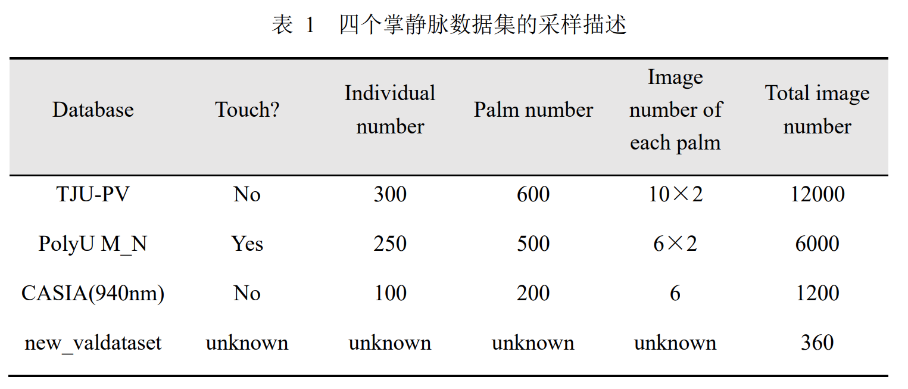
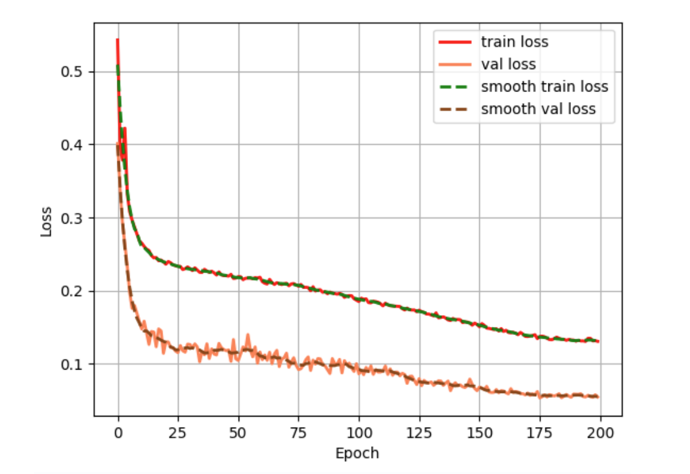
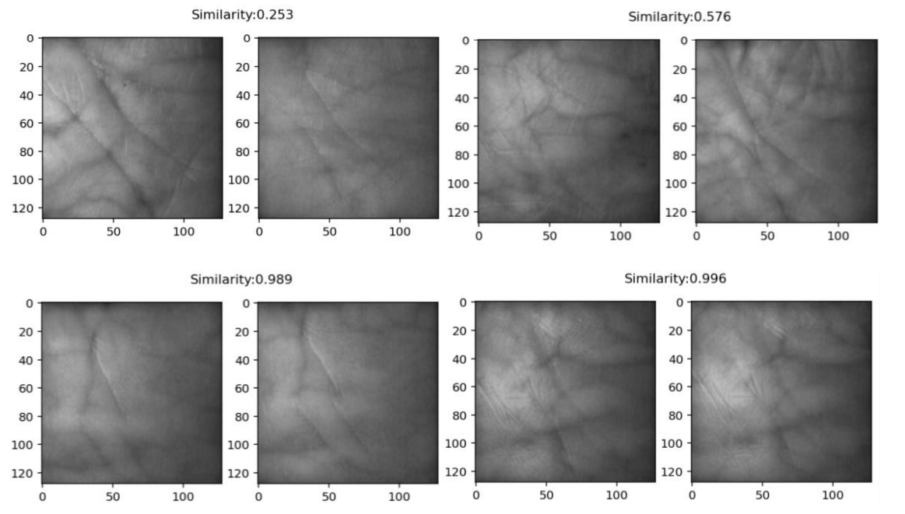

## Siamese-Pytorch：基于孪生神经网络的掌静脉识别研究

人类掌静脉图像包含丰富的特征，如今基于掌静脉的生物特征识别
技术研究越来越成为热点。本项目基于孪生神经网络的结构训练并得到了能够判断
两个手掌图像是否来自同一个手掌的模型，以VGG16为基础自行设计了VGG16-
modified 作为孪生神经网络的特征提取主干模型，并基于 L1 距离与全连接神经
网络设计了孪生神经网络的相似度度量模型。

同时，为给孪生神经网络特征提取主干网络提供较好的训练数据支撑，本项目对掌静脉识别过程中的 ROI 选取、图增强以及类间数据扩增进行了研究并取得了较好的效果。本项目最终训练得到的模型在数据量为 44160 的训练集上准确率达到了 93.6%、在数据量为 11040 的验
证集上准确率达到了 97.1%，并在未曾出现在训练集与验证集中的 180 对测试集
数据上达到了 93.3%的准确率，说明本文训练所得的模型泛化效果良好。 

## 所需环境
torch==1.2.0、GPU 型号为 NVIDIA A100-PCIE40GB。

## 数据准备
见`dataset`文件夹。包括三个掌静脉训练数据集（TJU、PolyU、CASIA）和一个验证集（new_valdataset）。

## 模型训练
本项目测试了各种超参数下的各种优化方法（sgd、adam），最后挑选最优结果。见`train开头的ipynb文件`。 

## 预测步骤
见`【7月5号】开头的两个ipynb文件`。

## 效果展示
- 训练与验证损失函数值、准确率随迭代的变化曲线：

- 模型在 new_valdataset 上测试的结果示例：
